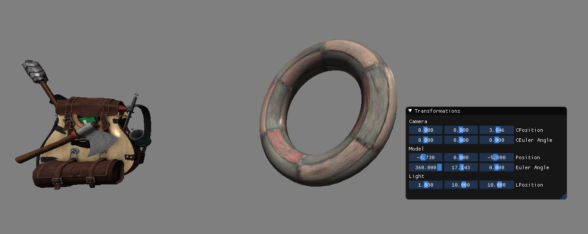

# OpenGL- Model viewer
Created to learn about computer graphics using OpenGL API

# What's inside?
* Diffuse and specular shading examples (1 light only)
* Transform class: Rotate and move an object or camera
* load .obj files and bind textures to them

Switch to x86 in Visual Studio to run

# Libraries used:
* tinyobjloader
* ImGUI
* stbi(Image loader)
